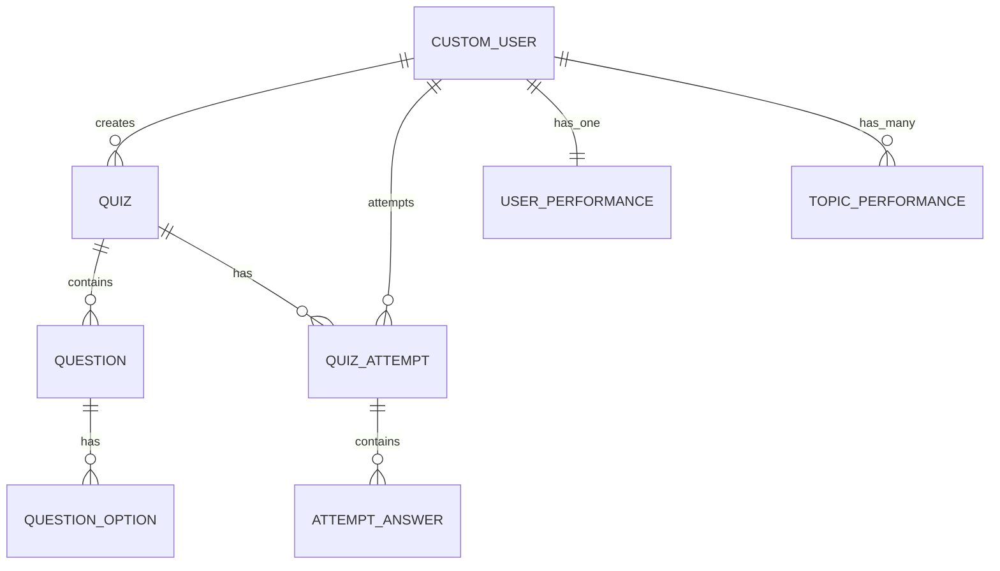

# Database Schema - ERD Reference

## Entity Relationship Diagram (Mermaid Format)



---

## Tables & Fields

### 1. users_customuser (Extends Django User)

| Column | Type | Constraints | Description |
|--------|------|-------------|-------------|
| id | BIGINT | PK, AUTO | Primary key |
| username | VARCHAR(150) | UNIQUE, NOT NULL | Unique username |
| email | VARCHAR(254) | UNIQUE, NOT NULL | User email |
| password | VARCHAR(128) | NOT NULL | Hashed password |
| role | VARCHAR(20) | DEFAULT='user' | admin or user |
| is_staff | BOOLEAN | DEFAULT=False | Django admin flag |
| is_superuser | BOOLEAN | DEFAULT=False | Django superuser |
| is_active | BOOLEAN | DEFAULT=True | Account active |
| date_joined | DATETIME | AUTO | Registration time |
| created_at | DATETIME | AUTO_ADD | Custom timestamp |

### 2. quizzes_quiz

| Column | Type | Constraints | Description |
|--------|------|-------------|-------------|
| id | BIGINT | PK, AUTO | Primary key |
| topic | VARCHAR(255) | NOT NULL | Quiz topic name |
| difficulty | VARCHAR(50) | NULL | easy/medium/hard |
| created_by_id | BIGINT | FK → users_customuser.id | Creator (admin) |
| created_at | DATETIME | AUTO_ADD | Creation time |

**Indexes:** None (uses default Django index)

### 3. quizzes_question

| Column | Type | Constraints | Description |
|--------|------|-------------|-------------|
| id | BIGINT | PK, AUTO | Primary key |
| quiz_id | BIGINT | FK → quizzes_quiz.id | Parent quiz |
| text | TEXT | NOT NULL | Question content |

**Indexes:** FK index on quiz_id

### 4. quizzes_questionoption

| Column | Type | Constraints | Description |
|--------|------|-------------|-------------|
| id | BIGINT | PK, AUTO | Primary key |
| question_id | BIGINT | FK → quizzes_question.id | Parent question |
| option_text | TEXT | NOT NULL | Option content |
| is_correct | BOOLEAN | DEFAULT=False | Correct answer flag |

**Indexes:** FK index on question_id

### 5. core_quizattempt

| Column | Type | Constraints | Description |
|--------|------|-------------|-------------|
| id | BIGINT | PK, AUTO | Primary key |
| user_id | BIGINT | FK → users_customuser.id | Attempting user |
| quiz_id | BIGINT | FK → quizzes_quiz.id | Attempted quiz |
| score | FLOAT | DEFAULT=0 | Score percentage |
| weighted_score | FLOAT | DEFAULT=0 | Weighted score |
| status | VARCHAR(20) | DEFAULT='in_progress' | in_progress/completed |
| metrics | JSON | DEFAULT=dict | Additional metrics |
| started_at | DATETIME | AUTO_ADD | Start time |
| completed_at | DATETIME | NULL | Completion time |

**Constraints:** UNIQUE(user_id, quiz_id) - One attempt per user per quiz

**Indexes:** 
- UNIQUE INDEX on (user_id, quiz_id)
- INDEX on user_id
- INDEX on quiz_id

### 6. core_attemptanswer

| Column | Type | Constraints | Description |
|--------|------|-------------|-------------|
| id | BIGINT | PK, AUTO | Primary key |
| attempt_id | BIGINT | FK → core_quizattempt.id | Parent attempt |
| question_id | BIGINT | FK → quizzes_question.id | Question answered |
| selected_option_id | BIGINT | FK → quizzes_questionoption.id | Selected option |
| is_correct | BOOLEAN | DEFAULT=False | Answer correctness |

**Indexes:** 
- FK index on attempt_id
- FK index on question_id
- FK index on selected_option_id

### 7. analytics_userperformance

| Column | Type | Constraints | Description |
|--------|------|-------------|-------------|
| user_id | BIGINT | PK, FK → users_customuser.id | User (OneToOne) |
| total_attempts | INTEGER | DEFAULT=0 | Total quizzes taken |
| avg_score | FLOAT | DEFAULT=0 | Average score |
| best_score | FLOAT | DEFAULT=0 | Best score achieved |
| elo_points | INTEGER | DEFAULT=1000 | ELO rating |
| rank | VARCHAR(50) | NULL | Rank title |
| last_attempt_at | DATETIME | NULL | Last attempt time |

**Indexes:** Primary key is user_id (OneToOne)

### 8. analytics_topicperformance

| Column | Type | Constraints | Description |
|--------|------|-------------|-------------|
| id | BIGINT | PK, AUTO | Primary key |
| user_id | BIGINT | FK → users_customuser.id | User |
| topic | VARCHAR(255) | NOT NULL | Topic name |
| total_attempts | INTEGER | DEFAULT=0 | Attempts in topic |
| avg_score | FLOAT | DEFAULT=0 | Average in topic |
| best_score | FLOAT | DEFAULT=0 | Best in topic |
| elo_points | INTEGER | DEFAULT=1000 | Topic ELO |
| rank | INTEGER | DEFAULT=0 | Rank in topic |
| last_attempt_at | DATETIME | NULL | Last attempt |

**Constraints:** UNIQUE(user_id, topic)

**Indexes:**
- UNIQUE INDEX on (user_id, topic)
- INDEX on (topic, -elo_points) for leaderboard queries

---

## Relationships Summary

```
CUSTOM_USER (1) ──────< (N) QUIZ
CUSTOM_USER (1) ──────< (N) QUIZ_ATTEMPT
CUSTOM_USER (1) ──────|| (1) USER_PERFORMANCE
CUSTOM_USER (1) ──────< (N) TOPIC_PERFORMANCE

QUIZ (1) ──────< (N) QUESTION
QUIZ (1) ──────< (N) QUIZ_ATTEMPT

QUESTION (1) ──────< (N) QUESTION_OPTION

QUIZ_ATTEMPT (1) ──────< (N) ATTEMPT_ANSWER
```

---

## Design Notes

1. **One-to-One Performance** - UserPerformance uses user_id as PK for efficiency
2. **Unique Constraints** - Prevents duplicate attempts and duplicate topic performance
3. **JSON Field** - metrics in QuizAttempt allows flexible data storage
4. **Indexes** - Added on frequently queried fields (leaderboards, lookups)
5. **Cascade** - Questions cascade delete with Quiz; Options with Question
6. **Soft Delete** - SET_NULL on created_by to preserve quiz history
